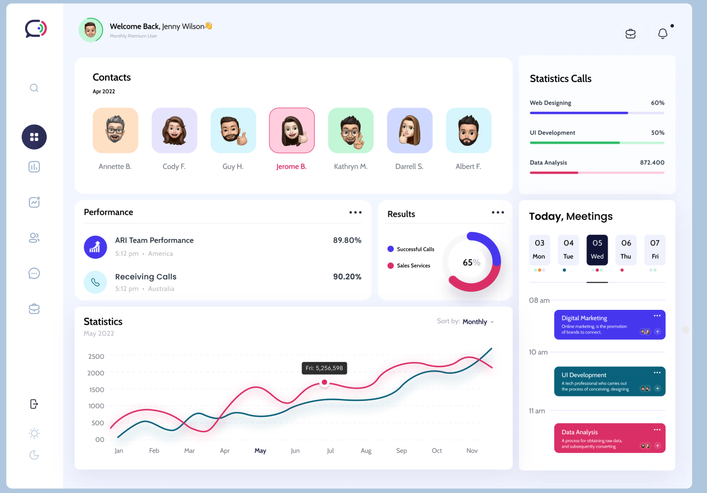

# Client Dashboard

## Objective

The main objective of this project is to create a versatile dashboard based on a mock-up design. The development process will proceed in several steps, each of which will introduce new layers of functionality and technology. The ultimate goal is to adapt the dashboard for specific purposes, such as project management, while continually refining the features and design.

## Approach

The development of this project will be carried out incrementally, allowing for a gradual improvement in skills related to HTML, JavaScript, CSS, and Bootstrap. The following approach will be followed:

1. **Step 1 - Generic Dashboard**: The initial step involves creating a generic dashboard based on a provided mock-up design. This step will focus on building a solid understanding of HTML, JavaScript, CSS, and Bootstrap, enabling us to craft the desired layout and components.

2. **Step 2 - Specific Purpose**: Once the generic dashboard is completed, the next phase involves tailoring it for a specific purpose. In this case, we will transform it into a project management dashboard. This step will introduce additional features and functionalities specific to project management.

3. **Iteration and Enhancement**: After achieving the project management dashboard, we will enter an iterative phase of development. Feedback and user testing will be utilized to enhance the dashboard's usability and refine its design. Further iterations may involve the addition of new features, performance optimization, and addressing any identified issues.

## Current Stack

The project utilizes the following technologies and tools:

- **Database**: Pocketbase
- **Language**: JavaScript
- **Front-end Framework**: React
- **CSS Framework**: Bootstrap

JavaScript serves as the primary programming language, providing the power and flexibility required for the project. React is utilized as the front-end framework, enabling the creation of reusable and modular components. Bootstrap serves as the CSS framework, ensuring a responsive and visually appealing design.

As the project progresses, we may incorporate additional technologies and tools to further enhance the dashboard's functionality and user experience.

## Getting Started

To run the Client Dashboard project locally, please follow these steps:

1. Clone the repository: `git clone https://github.com/your-username/client-dashboard.git`
2. Install the project dependencies: `npm install`
3. Start the development server: `npm start`
4. Start the database server: `./pocketbaseserve`
5. Access the dashboard in your browser at: `http://localhost:3000`

5. Open the backend directory './backend/pocketbase'
6. Run `./pocketbase serve`

If you encounter the error "pocketbase cannot be opened because the developer cannot be verified," follow these steps:

1. Right-click (or Control-click) on the "pocketbase" application.
2. Select "Open" from the context menu.
3. A dialog box will appear with the message "pocketbase cannot be opened because the developer cannot be verified." Click "Open" in the dialog box.

For more information on Pocketbase, visit their official documentation at https://pocketbase.io/docs/.

The dashboard can be accessed at the following URLs:
- http://127.0.0.1:8090: Serves static content from the pb_public directory (html, css, images, etc.).
- http://127.0.0.1:8090/_/: Admin dashboard UI.
- http://127.0.0.1:8090/api/: REST API.

Once the dashboard is up and running, you can access the API dashboard and use the following credentials:
- Email: admin@admin.com
- Password: password123

Please make sure that you have the required dependencies, including Node.js and npm, installed on your machine.

## REST API Database
the database is hosted on [pocketbase](https://pocketbase.io/).
Once the server is start via `./pocketbaseserve` the dashboard will be populated with API data.
To view the API in json format, follow the link for Rest API.
To view the Admin Dashboard follow the link for Admin UI.

Login details for Admin Dashboard:
Email: pocketbase143@gmail.com
Password: Thisisatest

## Contribution

Contributions to the Client Dashboard project are more than welcome. If you have suggestions, bug reports, or would like to contribute code, please follow these steps:

1. Fork the repository.
2. Create a new branch for your contribution: `git checkout -b feature/your-feature`
3. Make your changes and commit them: `git commit -m 'Add your feature'`
4. Push to your branch: `git push origin feature/your-feature`
5. Open a pull request with a detailed description of your changes.

Please ensure that your contributions align with the project's objectives and adhere to the established coding conventions.

## License

This project is licensed under the [MIT License](LICENSE). Feel free to modify and use the code according to the terms of the license.