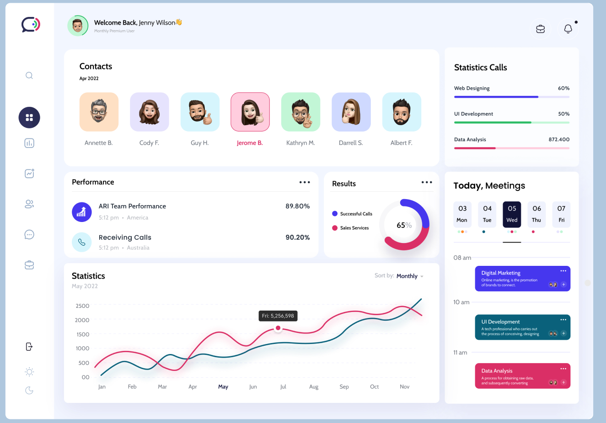
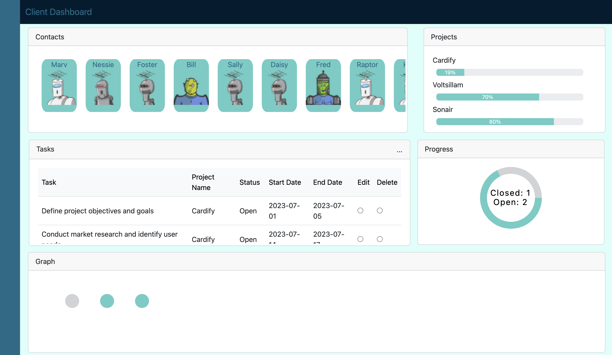

# Client Dashboard

## Objective
The objective of this project is to create a generic dashboard based on a mock-up design. The project will be developed in multiple steps, with each step adding new layers of functionality and technology. The ultimate goal is to update the dashboard for a specific purpose, such as project management, and iterate on the features and design.

## Approach
The project will be developed step-by-step, allowing for a gradual strengthening of skills in HTML, JavaScript, CSS, and Bootstrap. The following approach will be followed:

1. **Step 1 - Generic Dashboard**: The initial step involves creating a generic dashboard based on a provided mock-up design. This step focuses on building a foundational understanding of HTML, JavaScript, CSS, and Bootstrap to create the desired layout and components.

2. **Step 2 - Specific Purpose**: Once the generic dashboard is completed, the next step involves updating the dashboard for a specific purpose. In this case, the objective is to transform it into a project management dashboard. This step will introduce additional features and functionality specific to project management.

3. **Iteration and Enhancement**: After achieving the project management dashboard, the development process will enter an iterative phase. Feedback and user testing will be used to enhance the dashboard, improve its usability, and refine the design. Further iterations may involve adding new features, optimizing performance, and addressing any identified issues.

## Current Stack
The project utilizes the following technologies and tools:

- **Database**: Pocketbase
- **Language**: JavaScript
- **Front-end Framework**: React
- **CSS Framework**: Bootstrap

The project leverages the power and flexibility of JavaScript as the primary programming language. React is used as the front-end framework, enabling the creation of reusable and modular components. Bootstrap is employed as the CSS framework, providing a responsive and visually appealing design.

As the project progresses, additional technologies and tools may be incorporated to enhance the functionality and user experience of the dashboard.

## Getting Started
To run the Client Dashboard project locally, please follow these steps:

1. Clone the repository: `git clone https://github.com/your-username/client-dashboard.git`
2. Install the project dependencies: `npm install`
3. Start the development server: `npm start`
4. Access the dashboard in your browser at: `http://localhost:3000`

Ensure that you have the necessary dependencies, including Node.js and npm, installed on your machine.

## Contribution
Contributions to the Client Dashboard project are welcome. If you have suggestions, bug reports, or would like to contribute code, please follow these steps:

1. Fork the repository.
2. Create a new branch for your contribution: `git checkout -b feature/your-feature`
3. Make your changes and commit them: `git commit -m 'Add your feature'`
4. Push to your branch: `git push origin feature/your-feature`
5. Open a pull request with a detailed description of your changes.

Please ensure that your contributions align with the project's objectives and follow the established coding conventions.

## License
This project is licensed under the [MIT License](LICENSE). Feel free to modify and use the code according to the terms of the license.